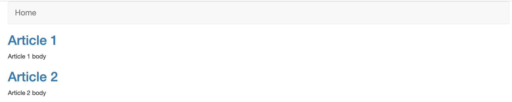
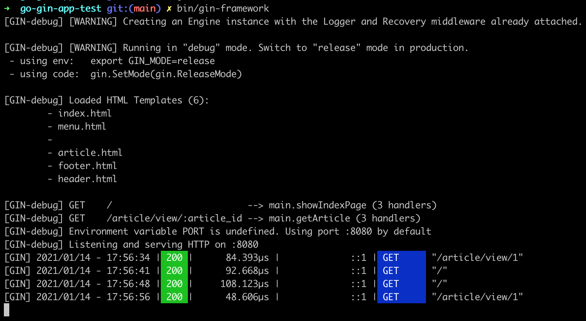
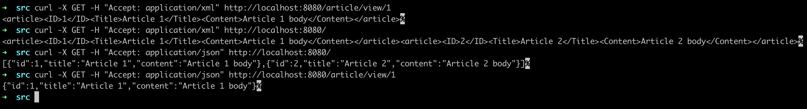
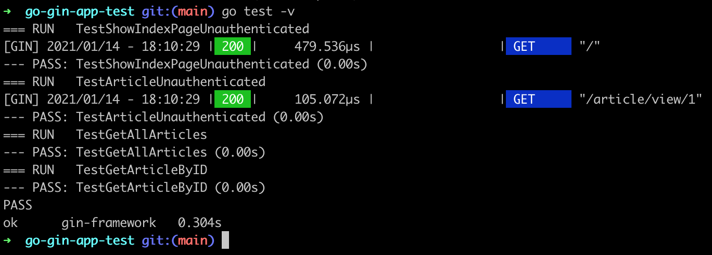

# Test gin-gonic framework:

Install dependencies:
````shell
    go get 
````

Run app:
````shell
    go build -o bin && bin/{folder}
````

Homepage:


Logs:


Run curl with different header types:


Run Test:

